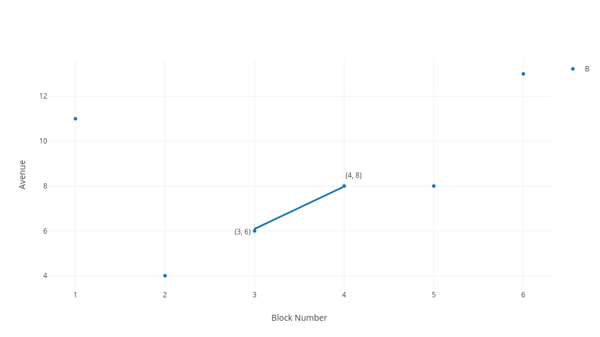
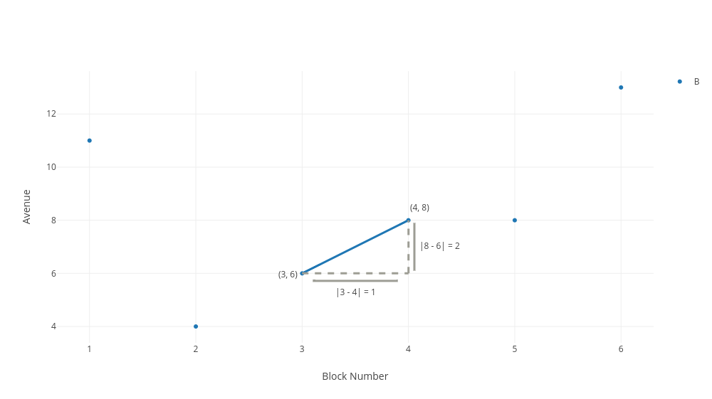

# Calculating Distance Readme

## Objectives

1. Learn about visualizations
2. Use python to access data for a visualization.

## Calculating the distance

Previously, we used visualizations to evaluate the closest customers to our salesperson, Bob.  Now that can work when we only have one salesperson, but when our business grows to have more salespeople, or when it becomes more difficult to approximate who is further away, we need a more formalized approach.  So let's see if there's a way that we can figure out the distance between Bob and a customer.

Once again, here are the locations of Bob and our customers:

| Name | Avenue #| Block # | 
|------|------| ------     |
| Bob    | 4  |     8     | 
| Suzie  | 1  |     11     | 
| Fred   | 5  |     11     | 
| Edgar  | 6  |     13     | 
| Steven | 3  |     5     | 
| Natalie| 5  |     4     | 
| Test   | 10 |   12      |

And here are these locations in the form of a scatter plot.

Now, there are no labels in this particular plot, but we should be able to make sense of it anyway.  Our table says that Bob is located at avenue 4 and block 8, and when we look at where the x-axis reaches 4 and the y-axis reaches 8, we see a marker right there - that's Bob.

Now are next task is to calculate the distance between Bob and another customer.  Let's choose how far Bob at point (4, 8) is from the customer at point (3, 6).

## Calculating distance

Here's our first approach at calculating distance.  To go from 8th street and 4th avenue to 6th street and 3rd avenue, we simply go two blocks down and one block to the left for a distance of three blocks.  

Now that's a good start, but it's not how mathematicians would calculate distance between points.  The definition of distance is the length of shortest path between two points.  So imagine, if it helps, that we made our deliveries with the help of a drone.  So then which path from (4, 8) to (3,6) is shortest? We won't prove it, but one single straight line between any two points is the shortest path between them.  So the shortest path between (4,8) and (3, 6) is a straight diagonal line between them.  

That blue diagonal line between the two points is the shortest path between the two points.  So by definition, the length diagonal line represents the distance.  So now we need to calculate the length of that line.

## Bring in the Pythagoros

Ok, to calculate that line, we realize that it forms a right triangle going from the lowest x-value to the highest x-value, 3 to 4 and from the lowest y-value to the highest y-value.  Take a look below, a nice triangle.

Formally, a right triangle is any triangle where one of the angles is 90 degrees -- also called the **right angle**.  But you can also just know that, if one of the sides are perfectly vertical and perfectly horizontal we have a right triangle -- and above we drew our triangle to be just like that.  The reason why we drew this is because, given the length of two sides of a right triangle we can find the length of the diagonal line - and the length of the diagonal line is the distance between our two points.  That diagonal line is called the **hypotenuse**.  The hypotenuse is the always longest line of a right triangle, and it is always directly opposite the right angle.  

 

This is our formula, for calculating the length of the diaganol line: the length of the first side squared plus the length of the second side square equals the length of the hypotenuse squared. We already calculated the horizontal side by subtracting our first x-value from our second x-value, then taking the absolute value.  The vertical side we calculated by subtracting the first y-value from the second y-value then taking the absolute value.  So we have.

|(x1 - x2)|^2 + |(y1 - y2)|^2 = (len_of_hypotenuse)^2 

Which, using the triangle above translates to:

|(3 - 4)|^2 + |(8 - 6)|^2 = (len_of_hypotenuse)^2

1^2 + 2^2 = (len_of_hypotenuse)^2

4 + 1 = (len_of_hypotenuse)^2

So simply by plugging in data, we can see that five equals the length of the hypotenuse, squared. 
> #### Squares, Square Roots, and Inverses
> **Squares** - Squaring something simply means multiplying something by itself.  So for example, 5 squared equals 5 $\times$ 5.  Four squared equals 4 $\times$ 4.  We denote four squared with the a raised number 2, as in $4^2$.  The two is the number of times we are multiplying four by itself.  

> **Square Roots** - Now we can go from a number's square back to the original square with the **square root**.  For example, the square of 4 is 4 $\times$ 4, which equals 16.  And the square root of 16 should undo the operation of squaring, so the square root of 16 equals four, and we denote the square root of 16 as $\sqrt{16}$.

> **Inverses ** - In mathematics, we **the inverse** is anything that undoes the operation.  So the inverse of squaring is taking the square root.  The inverse of multiplying by ten is dividing by ten.  Here is a question: 

> *What is the inverse of putting shoes on?*

> Well, just think of the definition - inverse means undoing the operation, and the undoing putting shoes on is taking shoes off.

So, now we have the famous **Pythagorean Formula**, which is in a right triangle, where c is the length of the hypotenuse, and a and b are the other two sides: 

 $a^2$ + $b^2$ = $c^2$
 
Then, we translate the length of the horizontal sides into lengths by using our x and y values of the points: 

$(x_{2} - x_{1})^2$ + $(y_{2} - y_{1})^2$ = $c^2$

Now we have a way to solve $c^2$, the square of the length of the diagonal.  To get the length of the diagonal, we simply take the square root of each side.  So ultimately our formula is: 

$c = \sqrt{(a^2 + b^2)}$ 

or 

$c = \sqrt{(x_{2} - x_{1})^2 + (y_{2} - y_{1})^2}$

where c is the length of the hypotenuse, or the distance between our two points.

> #### For the confused, read this

> Let's clarify two things: 

> ** 1. Why can we simply take the square root to get the length of the hypotenuse? **

> ** 2. Why do we no longer take the absolute value in calculating distances **

So now, simply plugging in our data we see that:

$c = \sqrt{(3 - 4)^2 + (6 - 8)^2}$

which equals

$c = \sqrt{1 + 4}$

which equals 
$c = \sqrt{5}$

Writing $\sqrt{5}$ as a distance is perfectly fine.  However, if you would rather see this in decimal form, simply plug the $\sqrt{5}$ into a calculator (or type "sqrt 5" into Google's search bar) and you will get 2.23.  So that is the distance between our two points.

### Summary

Ok, that was a lot of math, but it was worth it.  We now know that to calculate the distance between any two points we can simply square the differences the between the points's x and y values, sum the squares, and then take the square root of the sum to calculate the distance between two points.

We can do this because a single line is the shortest path between two points, also known as the distance between two points.  Because the Pythagorean Theorem gives us a formula $a^2$ + $b^2$ = $c^2$,  for calculating the length of a hypotenuse of any right triangle, we simply extend a horizontal line and a vertical line from the two points to form the remaining two sides of a right triangle, and then we calculate the distance by knowing that the square of one side, $a^2$ is $(x_{2} - x_{1})^2$ or the x coordinate of one point minus the x coordinate of the other point squared, and the square of the length of the other side, that is $b^2$, is $(y_{2} - y_{1})^2$, the y coordinate of one point minus the y coordinate of the other point squared.  So this gives us $(x_{2} - x_{1})^2$ + $(y_{2} - y_{1})^2$ = $c^2$ or, solving for c, $c = \sqrt{(x_{2} - x_{1})^2 + (y_{2} - y_{1})^2}$.
